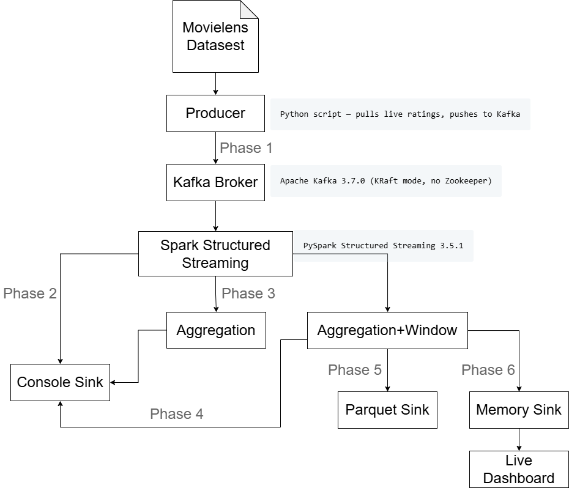

# Real-time Analysis of Movie Ratings with Apache Spark Structured Streaming

**Team:** Daniela Shahini, Jiaxin Li  
**Course:** Distributed Information System  
**Dataset:** MovieLens ratings (ml-latest-small) stream via Apache Kafka

---

## Overview

This project implements an end-to-end streaming analytics pipeline that ingests live movie ratings from a Kafka broker and processes them incrementally using Apache Spark Structured Streaming. Rather than treating the MovieLens dataset as a static dump, we observe ratings as a continuous stream — closer to how production recommendation systems operate.

The pipeline progresses through six phases, from basic stream ingestion to windowed trend detection.

---

## Architecture




All components run in Docker containers via Docker Compose.

---

## Repository Structure

```
movielens-spark-streaming/
├── docker-compose.yml          # Defines kafka, producer, spark services
├── checkpoints/                # Spark streaming checkpoints (auto-created)
│   ├── parquet_raw/
│   └── parquet_windows/
└── spark/
    ├── Dockerfile              # Image for both producer and spark containers
    ├── requirements.txt        # Python dependencies
    ├── producer.py             # Kafka producer — streams ratings into topic
    ├── phase1_kafka_test.py    # Plain Kafka consumer — confirms stream works
    ├── phase2_spark_console.py # Spark reads and parses JSON stream, print to the console
    ├── phase3_aggregations.py  # Running avg per movie and genre (stateful), to console
    ├── phase4_windows.py       # Sliding window trend detection, to console
    ├── phase5_parquet_sink.py  # Write and append the aggregation and sliding window results to parquet files
    ├── phase6_live_dashboard.py# Plotly read results from memory sink and display with a live dashboard
    └── ml-latest-small/        # Static MovieLens metadata (for enrichment)
```

---

## Prerequisites

- [Docker Desktop](https://www.docker.com/products/docker-desktop/) (Windows/Mac) or Docker Engine (Linux)
- Docker Compose v2 (included with Docker Desktop)
- At least 4 GB RAM allocated to Docker
- Internet access (producer connects to `get.awesomedata.stream:9093`)

---

## Quick Start

### 1. Clone the repository

```bash
git clone https://github.com/Shakesdola/movielens-spark-streaming.git
cd movielens-spark-streaming
```

### 2. Choose which phase to run

Open `docker-compose.yml` and find the last line of the `spark` service. Change the filename to the phase you want:

```yaml
# Select any of this lines and comment the others to switch phases:
command: python /app/phase1_kafka_test.py
command: spark-submit --packages org.apache.spark:spark-sql-kafka-0-10_2.12:3.5.1 /app/phase2_spark_console.py
command: spark-submit --packages org.apache.spark:spark-sql-kafka-0-10_2.12:3.5.1 /app/phase3_aggregations.py
command: spark-submit --packages org.apache.spark:spark-sql-kafka-0-10_2.12:3.5.1 /app/phase4_windows.py
command: spark-submit --packages org.apache.spark:spark-sql-kafka-0-10_2.12:3.5.1 /app/phase5_parquet_sink.py
command: spark-submit --packages org.apache.spark:spark-sql-kafka-0-10_2.12:3.5.1 /app/phase6_live_dashboard.py
```

| Phase | File | What it does                                                                |
|-------|------|-----------------------------------------------------------------------------|
| 1 | `phase1_kafka_test.py` | Plain Kafka consumer — confirms stream is live                              |
| 2 | `phase2_spark_console.py` | Spark parses JSON and prints raw records                                    |
| 3 | `phase3_aggregations.py` | Running averages per movie and genre                                        |
| 4 | `phase4_windows.py` | Sliding window trend detection                                              |
| 5 | `phase5_parquet_output.py` | Writes raw ratings and windowed trends to Parquet                           |
| 6 | `phase6_live_dashboard.py` | In-memory aggregations with live Plotly dashboard |
### 3. Start the pipeline

```bash
docker compose up -d
```

### 4. Watch the output

```bash
docker compose logs -f spark
```

### 5. Stop the pipeline

```bash
docker compose down
```

---

## Phase Details

### Phase 1 — Kafka Connection Test (`phase1_kafka_test.py`)

Confirms the local Kafka broker is receiving ratings from the MovieLens stream. Prints 20 raw messages then exits.

Expected output:
```
✅ Connected to Kafka on attempt 1
  [  1] User  414 rated 'Bad Boys (1995)'  →  2.0 ⭐  | genres: ['Action', 'Comedy']
  [  2] User  489 rated 'Descendants, The (2011)'  →  3.5 ⭐  | genres: ['Comedy', 'Drama']
✅ Phase 1 PASSED — Kafka stream is working perfectly.
```

### Phase 2 — Spark JSON Parsing (`phase2_spark_console.py`)

Spark reads from Kafka and decodes each JSON message into structured columns: `userId`, `movieId`, `title`, `genres`, `rating`, `timestamp`. Prints one record per micro-batch to console.

### Phase 3 — Stateful Aggregations (`phase3_aggregations.py`)

Two running aggregations updated on every micro-batch:

- **Movie stats** — running average rating and count per movie (shown only for movies with 3+ ratings)
- **Genre stats** — rating volume and average score per genre across all time

Output mode: `complete` (full table reprinted each batch).

### Phase 4 — Sliding Window Trend Detection (`phase4_windows.py`)

Detects which genres have the highest activity in recent time windows using:

- Window size: 10 minutes
- Slide interval: 2 minutes  
- Watermark: 5 minutes (tolerates late-arriving data)
- Event time: processing time (`current_timestamp`) — used because the source timestamps are historical

Output mode: `update` (only changed windows are printed per batch).

Example output:
```
+------------------------------------------+---------+----------+------------+
|window                                    |genre    |avg_rating|rating_count|
+------------------------------------------+---------+----------+------------+
|{2026-05-11 15:48:00, 2026-05-11 15:58:00}|Drama    |4.25      |12          |
|{2026-05-11 15:48:00, 2026-05-11 15:58:00}|Comedy   |3.6       |8           |
|{2026-05-11 15:48:00, 2026-05-11 15:58:00}|Sci-Fi   |3.429     |7           |
+------------------------------------------+---------+----------+------------+
```

### Phase 5 — Persisting Streaming Results to Parquet (`phase5_parquet_sink.py`)

Persists streaming results to Parquet files for offline analysis and batch-vs-stream comparison.

Two datasets are continuously written:

#### Raw Parsed Ratings
Saved to:
```text
/output/raw_ratings/
```

Contains every parsed rating event received from Kafka, including:

- userId
- movieId
- title
- genres
- rating
- event_time

Output mode:
```text
append
```

Each incoming micro-batch appends new rows to Parquet storage.


#### Windowed Genre Trends
Saved to:
```text
/output/windowed_trends/
```

Contains sliding-window aggregations generated in Phase 4:

- window start/end
- genre
- average rating
- rating count

Configuration:

- Window size: 10 minutes
- Slide interval: 2 minutes
- Watermark: 30 seconds

Output mode:
```text
append
```

This dataset enables:

- Offline batch recomputation
- Stream-vs-batch validation
- Historical trend analysis
- Dashboard replay and experimentation

The streaming job runs for 30 minutes before automatically stopping.

Example startup log:
```text
=== Phase 5: Writing to Parquet (runs for 30 minutes then stops) ===
```

Example completion log:
```text
=== Done. Check /output/ for Parquet files. ===
```

---

### Phase 6 — Real-Time Dashboard (`phase6_live_dashboard.py`)

Builds a live analytics dashboard using:

```text
Kafka → Spark Structured Streaming → Memory Sink → Dash + Plotly
```

The dashboard continuously queries Spark memory tables and updates visualizations every 10 seconds.

Open locally:
```text
http://localhost:8050
```

---

#### Live KPI Cards

The dashboard displays continuously updating metrics:

- Total ratings processed
- Number of unique movies
- Number of unique users
- Global average rating

These KPIs are recomputed after every micro-batch using Spark memory tables.

Four charts are displayed for intuitively observation:

- Chart 1 — Rating volume and average score by genre
- Chart 2 - Recent top-10 movies (last 10-minute window)
- Chart 3 - Event trends: Ratings received per 10-second interval
- Chart 4 - Distribution of movie average ratings


---

## Configuration

### Switching phases

Edit the `command` line in `docker-compose.yml` under the `spark` service. After changing, restart:

```bash
docker compose down
docker compose up -d
```

If switching to Phase 4 and 5 from another phase, clear the checkpoint first:

```bash
# Windows (PowerShell)
Remove-Item -Recurse -Force checkpoints\*
Remove-Item -Recurse -Force output\*

# Mac/Linux
rm -rf checkpoints/*
rm -rf output/*
```


### Spark configuration

| Setting | Value |
|---------|-------|
| Spark version | 3.5.1 |
| Kafka package | `spark-sql-kafka-0-10_2.12:3.5.1` |
| Shuffle partitions | 4 |
| Log level | WARN |

---

## Troubleshooting

**Containers exit immediately**  
Check logs: `docker compose logs spark`  
Most common cause: Kafka not ready yet. Wait 30 seconds and retry.

**Empty batches in Phase 3 (movie table)**  
The movie table requires 3+ ratings for the same movie. This takes a few minutes to accumulate — normal behaviour.

**Empty batches in Phase 4**  
If using event-time timestamps from the source data, Spark's watermark drops them as late. The fix is already applied in the current `phase4_windows.py` — it uses `current_timestamp()` instead.

**`failOnDataLoss` error**  
Kafka aged out messages between restarts. Already handled in Phase 4 with `.option("failOnDataLoss", "false")`.

**`grep` not found on Windows**  
Use PowerShell equivalent: `docker compose logs spark | Select-String "ERROR"`

---

## Dependencies

Listed in `spark/requirements.txt`. Key packages:

- `pyspark==3.5.1`
- `kafka-python`

The Spark Kafka connector is loaded at runtime via `--packages` in the `spark-submit` command — no manual JAR download needed.

---
